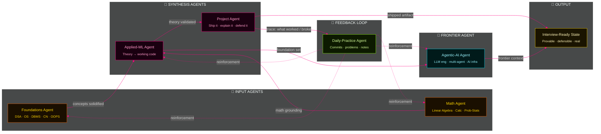

 

 

## ⚡ What this is

A public, dated, no-gaps-hidden training log — building placement-level computer science depth and an AI/ML engineering foundation, from scratch, in the era where the ground keeps moving.

Not a highlight reel. If a day is weak, it stays visible. If a week is strong, the commit graph proves it. Everything here is aimed at one outcome: **being able to defend, in a room, everything I've shipped and everything I've learned** — not just having prompted my way to an output.

---

## 🔥 The system, agent's-eye view

This isn't a subject list. It's how the pieces actually drive each other — read it the way an orchestrating agent would trace a pipeline: signal in, state updated, signal out, loop closes.

**The loop that matters:** foundations and math feed synthesis, synthesis feeds both shipped projects *and* the agentic-AI frontier layer, everything lands as defensible output — and daily practice runs underneath, continuously reinforcing every upstream node instead of running once and stopping.

---

## 📡 Live trackers

**Commit pulse**

**Contribution graph**

**Top languages**

> All widgets pull live from GitHub on every page load. If a card looks empty right now, that's real state, not a broken embed — it fills in as commits land.

---

## 🎥 Resource stack

Everything actively being worked through, source material only — logged progress lives in `/logs`, not here.

<b>🧩 Placement prep</b>

 

| Track | Resource |
|---|---|
| DSA | [Playlist ↗](https://youtube.com/playlist?list=PLDzeHZWIZsTryvtXdMr6rPh4IDexB5NIA&si=2GbbBaEQXE0glJmE) |
| Operating Systems | [Watch ↗](https://youtu.be/3obEP8eLsCw?si=X7Xq6ffngPAnVD6Y) |
| DBMS | [Watch ↗](https://youtu.be/dl00fOOYLOM?si=izZ3rMBrgChRnAlS) |
| Computer Networks | [Watch ↗](https://youtu.be/IPvYjXCsTg8?si=8x6QVsylaUPKjfpy) |
| OOPs | [Watch ↗](https://youtu.be/JeYx8vJB75Q?si=jq32hJ4JsD8rtAzT) |
| Aptitude | [Playlist ↗](https://youtube.com/playlist?list=PL8p2I9GklV454LdGfDOw0KkNazKuA-6B2&si=V0e0vdXTUlbOXTP7) |

<b>📐 AI/ML — Math</b>

 

| Track | Resource |
|---|---|
| Linear Algebra | [Playlist ↗](https://youtube.com/playlist?list=PLVyM62CSsh3U-hY5vDgjYRWiIQ2ZfQFkt&si=QBkQ3jPq3a63NRy3) |
| Calculus | [Playlist ↗](https://youtube.com/playlist?list=PLVyM62CSsh3VjQ-iU3ckhf5eYsSLkpdi5&si=q2-oW77TFCdK2mDq) |
| Probability & Statistics | [Playlist ↗](https://youtube.com/playlist?list=PLVyM62CSsh3WmT4vnxhtiPLp1ZNxfgqNQ&si=ZgiYeQSkDFWXQkIx) |

<b>🤖 AI/ML — Core</b>

 

| Track | Resource |
|---|---|
| Python for AI & AI Agents | [Playlist ↗](https://youtube.com/playlist?list=PL-Y17yukoyy0SupAJSPQYg_Lvre9Kt9EG&si=b8BS3YGTnCoF3_y6) |
| ML & Deep Learning | [Playlist ↗](https://youtube.com/playlist?list=PLaldQ9PzZd9qT0KsKJ7yCq70iFFP3MFJ5&si=wAvXbdn12upCokct) |

<b>🚀 Specialized AI domains — the moving frontier</b>

 

Active research and product areas, not a fixed final layer — the target keeps shifting and that's the point:

`LLM Engineering` · `AI Infrastructure` · `Multi-Agent Systems` · `Agentic AI` · `AI Systems & Research`

**Cutting edge, evolving fast:** World Models · Robotics + AI · Embodied AI · AI Operating Systems · Autonomous Software Engineers · Long-horizon Autonomous Agents · Self-Improving AI Systems

---

## 🧭 Operating principles

- **Understand it, don't just prompt it.** Every AI-assisted build gets a note on *why*, not just *what* — the reasoning is the actual deliverable.
- **Daily > sporadic.** The loop only reinforces if it runs continuously.
- **Public by design.** Gaps stay visible on purpose — a real log is more convincing than a curated one.
- **Depth before breadth.** Foundations fully, then applied ML, then the frontier layer that never stops moving.

---

**Status:** 🔥 loop is live · **Next log:** `/logs/weekly`

