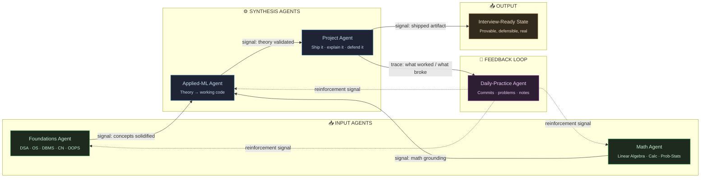

---

## What this actually is

Not a portfolio. A **live build log** — every day of grinding DSA, CS fundamentals, applied math, and ML/DL toward an AI/ML engineering role, tracked in public with nothing hidden. If a day was weak, the log says so. If a week was strong, the commits prove it.

This README itself is part of the system — it's built to be read the way an autonomous agent would trace a pipeline: nodes, signals, feedback loops. That's deliberate.

---

## The pipeline — agent's-eye view

Not "subjects in a list." This is how the pieces actually feed each other, the way an agent orchestrating this system would see it: signals in, state updated, signals out.

**Read it like a system, not a syllabus:** two input agents feed a synthesis layer, synthesis produces shipped, defensible output, and the daily-practice loop constantly reinforces every upstream node instead of running once and stopping. Nothing here is linear-and-done — it's a closed loop that gets more reinforced the longer it runs.

---

## Live trackers

### Commit pulse

### Streak

### Contribution graph

> All three pull live from GitHub's public commit history on every page load — no manual updates, no stale numbers. If it says 0, that's real, not a placeholder.

---

## Progress state

| Node | State | Target |
|---|:---:|---|
| DSA (pattern-first) | 🟡 active | 150–200 problems |
| OS / DBMS / CN / OOPS | ⚪ queued | Interview-depth, once, done right |
| Aptitude | ⚪ queued | Spread across weeks |
| Linear Algebra | ⚪ queued | — |
| Probability & Statistics | ⚪ queued | — |
| Calculus | ⚪ queued | Light pass |
| Python for AI / Agents | ⚪ queued | — |
| ML & Deep Learning | ⚪ queued | Core algos + 1–2 architectures |
| Weekly ship | 🟢 running | Every week, no skips |
| Capstone (EdgeDaemon) | 🟢 running | Tied directly to Project Agent above |

🟢 running · 🟡 active-but-early · ⚪ queued — updated by hand alongside real commits, not vibes.

---

## Operating principles

- **Understand it, don't just prompt it.** Every AI-assisted build gets a note on *why*, not just *what* — the reasoning is the actual deliverable.
- **Daily > sporadic.** The loop above only reinforces if it runs continuously.
- **Public by design.** Gaps stay visible on purpose — a real log is more convincing than a curated one.
- **Depth before breadth.** Foundations fully, then applied ML, then everything downstream.

---

**Currently:** grinding foundations · **Loop status:** 🟢 live · **Next log:** `/logs/weekly`

